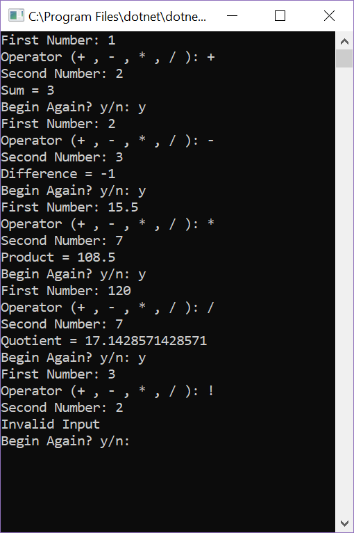

# Prework-Calculator

## Instructions
Upon prompt, enter in your first number, then your operator of choice, then your second number.
The program will return the sum, difference, product or quotient.
Respond to the prompt asking if you would like to continue. Enter y to run another number, n to close out.

## Sample Product

#### Help From:
- Windows C# Documentation: docs.microsoft.com/en-us/dotnet/csharp/language-reference/

